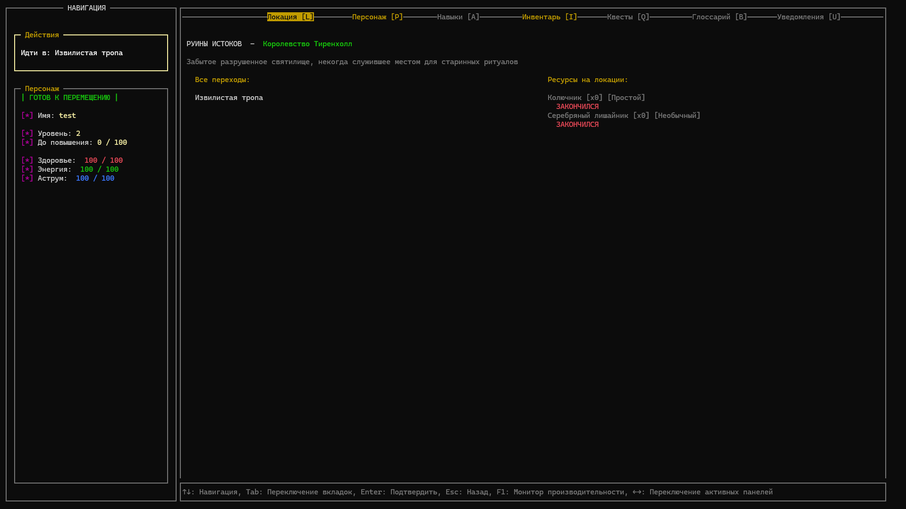

# PyConsoleRPG

Интерактивная консольная RPG-игра, написанная на Python. Проект включает собственный UI-фреймворк на базе msvcrt и ctypes, систему экранов, сериализацию состояния игры и расширяемую регистрацию сущностей (предметы, регионы, локации и т.д).

## Требования

- Python >= 3.12
- Windows 10/11

## Установка и запуск

1. Клонируйте репозиторий или загрузите архив проекта

```bash
$ git clone https://github.com/KiyotakkkkA/PyConsoleRPG.git
$ cd PyConsoleRPG
```

2. Создайте виртуальное окружение и активируйте его (рекомендуется)

```bash
$ python -m venv [название_окружения]
$ .\"[название_окружения]/Scripts/activate"
```

<u>ПРИМЕЧАНИЕ:</u> <br>
*Если вдруг ваша версия Python ниже 3.12, возможно, вам придется использовать команду ниже для активации виртуального окружения:
```bash
$ .\"[название_окружения]/bin/activate"
```

<u>ВАЖНО:</u> <br>
*На версиях ниже 3.12 игра может работать нестабильно*

3. Установите зависимости

```bash
$ pip install -r requirements.txt
```

4. Запустите игру через main.py <br>
Необходимо это делать в PowerShell, открытой в полноэкранном режиме [`Alt + Enter`]

```bash
$ python main.py
```

ИЛИ

4. Запустите игру через launcher.py <b><u>(рекомендуется)</u></b>; <br>
До запуска launcher.py нужно установить английскую раскладку клавиатуры,
а так же не снимать фокус с окна PowerShell до запуска игры. 

```bash
$ python launcher.py
```

## Скриншоты

| Игровой экран |
|--------------|
|  |

## Как внести вклад

1. Сделайте форк репозитория
2. Создайте новую ветку `git checkout -b feature/[new-feature]`
3. Внесите изменения
4. Откройте Pull Request